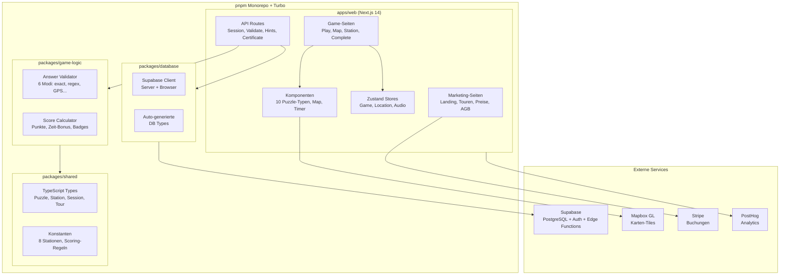
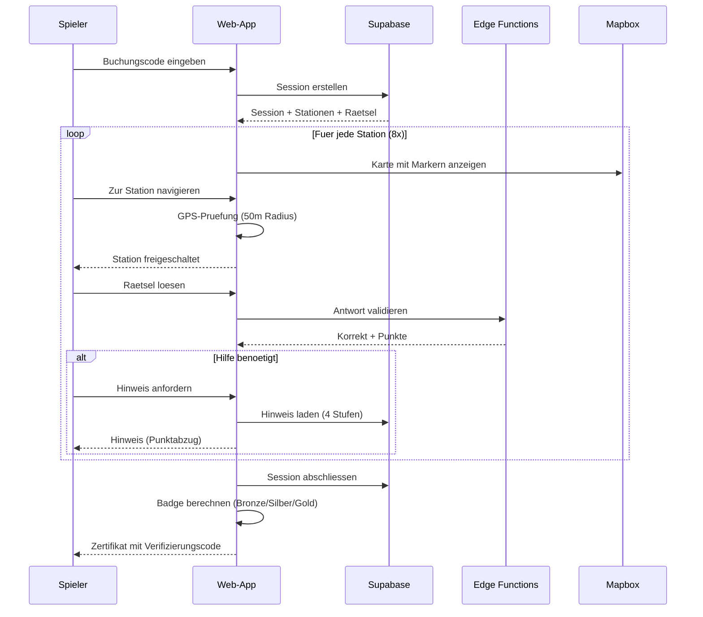
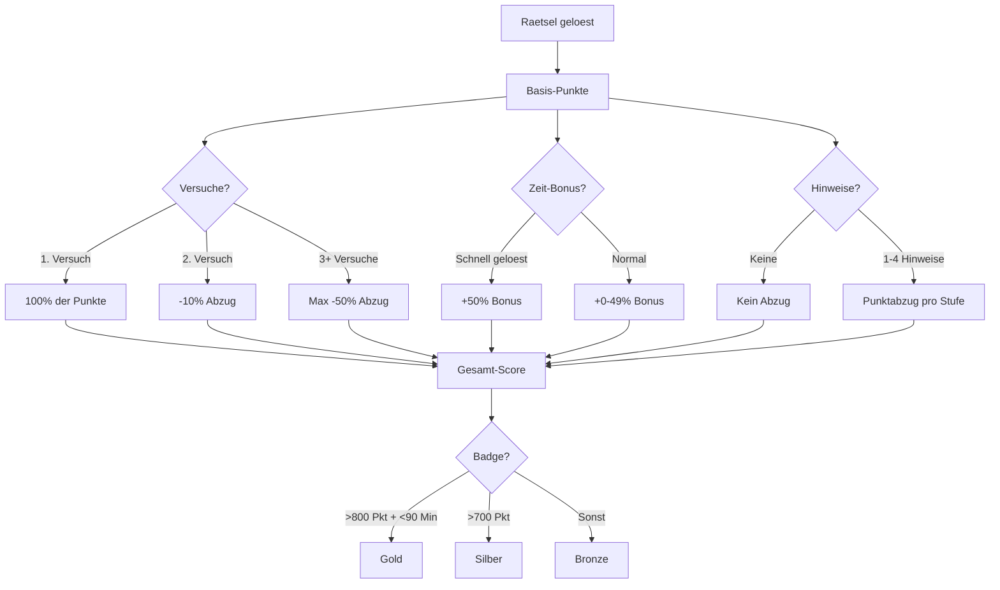
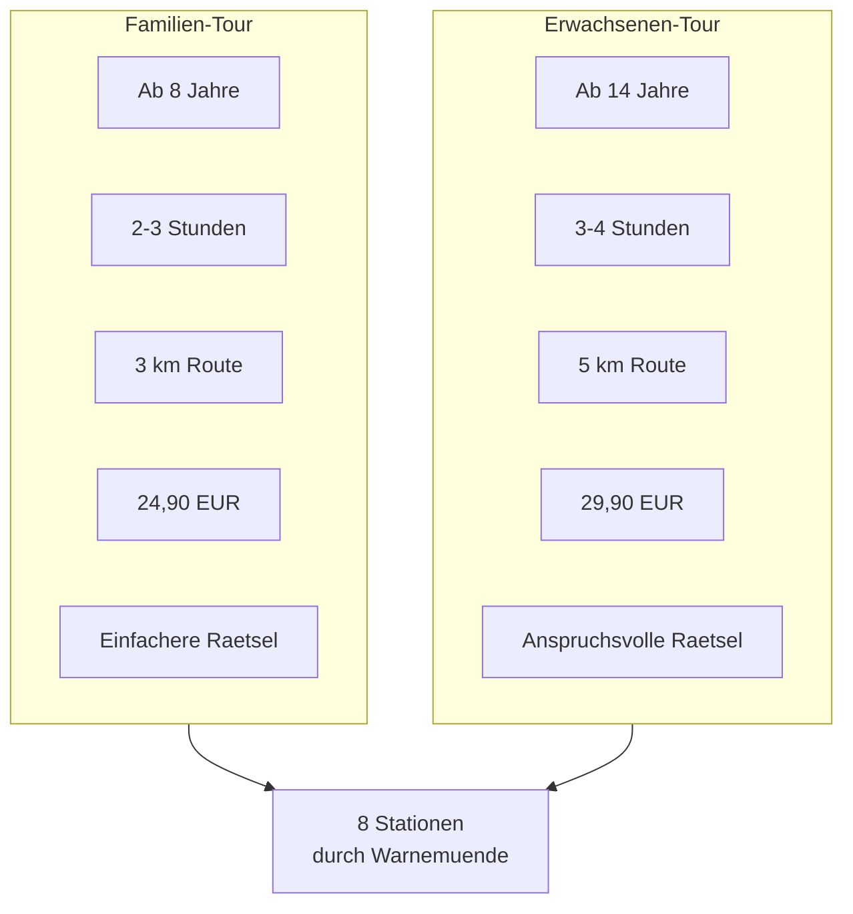

# Escape Tour Warnemuende

Interaktive Escape-Tour Web-App fuer Warnemuende: "Das Vermaechtnis des Lotsenkapitaens". GPS-basiertes Raetsel-Abenteuer durch die maritime Geschichte mit 10 Puzzle-Typen, Offline-Support und Echtzeit-Scoring.

---

## Architektur



## Spielablauf



## Scoring-System



## Puzzle-Typen

```mermaid
graph LR
    subgraph Raetsel["10 Puzzle-Typen"]
        P1["CountPuzzle<br/>Objekte zaehlen"]
        P2["TextInputPuzzle<br/>Freitext-Antwort"]
        P3["PhotoSearchPuzzle<br/>Foto-Suche vor Ort"]
        P4["SymbolFindPuzzle<br/>Symbole finden"]
        P5["CombinationPuzzle<br/>Code-Kombination"]
        P6["ARPuzzle<br/>Augmented Reality"]
        P7["AudioPuzzle<br/>Hoer-Raetsel"]
        P8["LogicPuzzle<br/>Logik-Aufgabe"]
        P9["NavigationPuzzle<br/>GPS-Navigation"]
        P10["DocumentAnalysisPuzzle<br/>Dokument-Analyse"]
    end

    subgraph Validation["6 Validierungs-Modi"]
        V1["exact"]
        V2["contains"]
        V3["regex"]
        V4["range"]
        V5["gps_proximity"]
        V6["multiple"]
    end

    Raetsel --> Validation
```



## Tour-Varianten



---

## Tech-Stack

| Komponente | Technologie |
|---|---|
| Frontend | Next.js 14, React, Tailwind CSS |
| State Management | Zustand 5.0 (persistiert) |
| Animationen | Framer Motion 12.4 |
| Karten | Mapbox GL 3.9 |
| Audio | Howler.js 2.2 |
| PWA/Offline | next-pwa 5.6 + IndexedDB |
| Datenbank | Supabase (PostgreSQL + Auth + Edge Functions) |
| Payment | Stripe |
| Analytics | PostHog |
| Monorepo | pnpm 10.21 + Turbo 2.4 |
| Testing | Vitest 4.0 |
| Deployment | Docker + Traefik (Let's Encrypt) |

---

## Voraussetzungen

- Node.js >= 20
- pnpm 10.21
- Docker & Docker Compose (fuer Deployment)
- Supabase-Projekt
- Mapbox API Token
- Stripe Account

---

## Schnellstart

```bash
# 1. Repository klonen
git clone https://github.com/manufarbkontrast/escape-tour-warnemuende.git
cd escape-tour-warnemuende

# 2. Dependencies installieren
pnpm install

# 3. Umgebungsvariablen
cp .env.example .env
# .env befuellen (siehe unten)

# 4. Entwicklung starten
pnpm dev

# 5. Tests ausfuehren
pnpm test
```

---

## Umgebungsvariablen

```env
# Supabase
NEXT_PUBLIC_SUPABASE_URL=https://xxx.supabase.co
NEXT_PUBLIC_SUPABASE_ANON_KEY=xxx
SUPABASE_SERVICE_ROLE_KEY=xxx

# Mapbox
NEXT_PUBLIC_MAPBOX_TOKEN=xxx

# Stripe
STRIPE_SECRET_KEY=sk_xxx
NEXT_PUBLIC_STRIPE_PUBLISHABLE_KEY=pk_xxx
STRIPE_WEBHOOK_SECRET=whsec_xxx

# PostHog
NEXT_PUBLIC_POSTHOG_KEY=xxx
NEXT_PUBLIC_POSTHOG_HOST=https://eu.posthog.com

# App
NEXT_PUBLIC_APP_URL=https://escape-tour-warnemuende.de
```

---

## Projektstruktur

```
escape-tour-warnemuende/
├── apps/web/                     # Next.js Web-App
│   ├── app/
│   │   ├── (marketing)/          # Landing, Touren, Preise, Kontakt, AGB
│   │   ├── (game)/play/          # Spiel-Seiten
│   │   │   ├── page.tsx          # Code-Eingabe
│   │   │   └── [sessionId]/      # Spiel-Ansicht + Abschluss
│   │   └── api/game/             # Session, Validate, Hints, Certificate
│   ├── components/
│   │   ├── game/                 # PuzzleRenderer, MapView, HintSystem, Timer
│   │   │   └── puzzles/          # 10 Puzzle-Komponenten
│   │   ├── ui/                   # OfflineIndicator
│   │   └── marketing/            # FaqAccordion
│   ├── stores/                   # gameStore, locationStore, audioStore
│   ├── lib/
│   │   ├── supabase/             # Server + Client
│   │   ├── demo/                 # Demo-Modus (Testdaten)
│   │   └── offline/              # IndexedDB Sync
│   └── Dockerfile
├── packages/
│   ├── shared/                   # Types + Constants
│   ├── game-logic/               # Validation + Scoring (pure functions)
│   └── database/                 # Supabase Client + Types
├── docker-compose.yml            # Traefik + App
├── turbo.json                    # Build-Orchestrierung
└── pnpm-workspace.yaml
```

---

## Features

- **10 Puzzle-Typen**: Count, Text, Photo, Symbol, Combination, AR, Audio, Logic, Navigation, Document
- **GPS-basiert**: Stationen werden per Geolocation freigeschaltet (50m Radius)
- **Interaktive Karte**: Mapbox mit Stations-Markern (abgeschlossen/aktuell/gesperrt)
- **Hint-System**: 4 Stufen (klein, mittel, gross, Loesung) mit Punktabzug
- **Offline-Support**: PWA + IndexedDB + Service Worker Caching
- **Scoring**: Punkte, Zeit-Bonus, Versuchs-Abzug, Badge-System (Bronze/Silber/Gold)
- **Zertifikat**: PDF-Export mit Verifizierungscode
- **Story-Modus**: Maritime Geschichte mit Markdown + Audio
- **Dual-Ansicht**: Karten-Navigation + Stations-/Raetsel-Detail
- **Pause/Resume**: Sessions koennen pausiert und fortgesetzt werden
- **Demo-Modus**: Testspiel ohne Buchung

---

## Deployment

```bash
# Docker Build
docker build -f apps/web/Dockerfile \
  --build-arg NEXT_PUBLIC_SUPABASE_URL=... \
  --build-arg NEXT_PUBLIC_MAPBOX_TOKEN=... \
  -t escape-tour:latest .

# Docker Compose (mit Traefik + SSL)
docker-compose up -d
```
